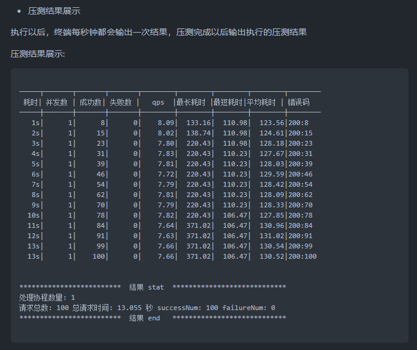
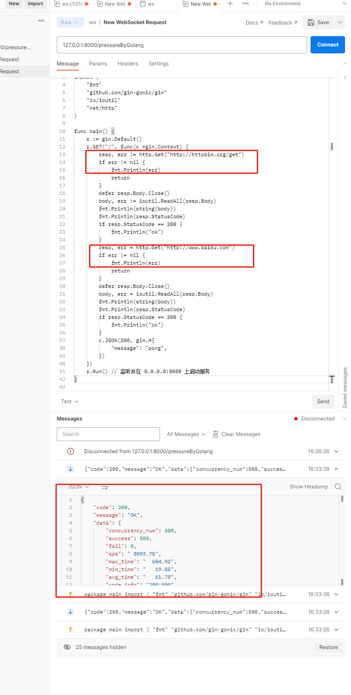

# pressure-test-admin
# 项目背景：  
最近了解了下go的压测工具，发现绝大多数都只是局限于对着某一个http地址利用协程进行压测，突发奇想了一个需求<如果有一些需要链式压测的场景呢？比如先请求A服务，然后拿到A服务的响应当作B服务的入参再去请求B服务，然后把整个链路当作一个整体来统计压测指标>，然后按照我的需求去找了下，发现好像并没有合适的go开源工具。。  
  
另外还遇到一个问题就是绝大多数的开源压测工具要么提供cmd命令行自己本地敲一敲压一压就完了。要么就是提供完整的前后端包括组件在内的可视化部署的重量级的，所以打算自己搞一套满足下自己的好奇心以及一些临时的小需求
# go-stress-testing
因为我目前的开发主语言是golang，所以我在参考开源项目的时候还是以golang开源压测项目为主。找了下 github 发现 go-stress-testing 这款压测工具就很不错，提供的压测渠道（url/curl/websocket）比较丰富，而且压测模型的代码也写的很好，想了解的可以去看看 https://github.com/link1st/go-stress-testing
  
# 改造
go-stress-testing 目前的开源版本只支持 cmd 调用，为了方便后续压测接入我在它的压测模型之上包装了一层 websocket 协议，使用 websocket 而不是 http 的原因也很简单，细化压测的过程，服务端每秒将当前的压测指标输出出来，使得压测的过程更加透明，而不是只展示一个最终结果，就像 go-stress-testing
 本身做的那样  
  

为了满足我前面提到的突发奇想的需求，我使用了一种自己都觉得比较骚气的方式：在压测服务中通过外部输入的golang代码去生成子服务，然后再在压测服务中对子服务进行压测，子服务内完全可以做到A->B->C的链式调用，而压测服务只需要把子服务当作一个整体来统计压测指标，从而实现链式压测  

# 使用
安装 go1.16 或以上版本  
拉取项目后直接在目录下 go run main.go 或编译执行即可启动一个占用8000端口的服务
# 总结
方法简单粗暴，代码后续有问题再改进，我觉得这个需求是肯定有人用到的